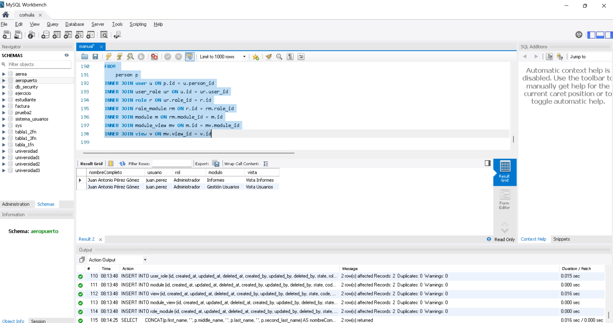

## Obtener la lista de vistas a las que un usuario tiene acceso.
* [person] nombreCompleto (first_name, middle_name, last_name, second_last_name)
* [person] nombreCompleto (first_name, middle_name, last_name, second_last_name)
*[user] usuario(username)
*[role] rol(name)
*[module] modulo(name)
*[view] vista [name]

    autor:Alejandro Ortiz Vargas