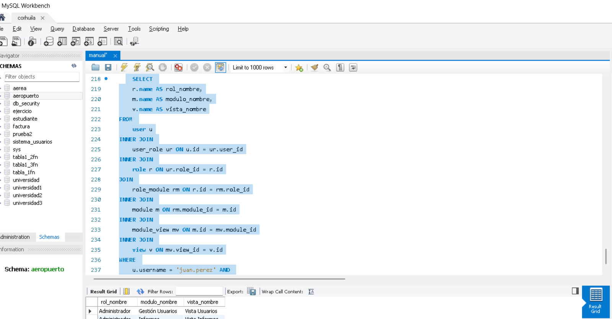

# Caso 3: Mostrar la lista de roles a los que tiene acceso una persona

## Descripción
El objetivo de este caso es mostrar la lista de roles a los que un usuario tiene acceso. Cada rol está asociado con una lista de módulos, y cada módulo puede tener varias vistas. Para mostrar esta información, se requiere recibir un par de credenciales: un nombre de usuario y una contraseña. Si las credenciales no coinciden, no se mostrará la información.

